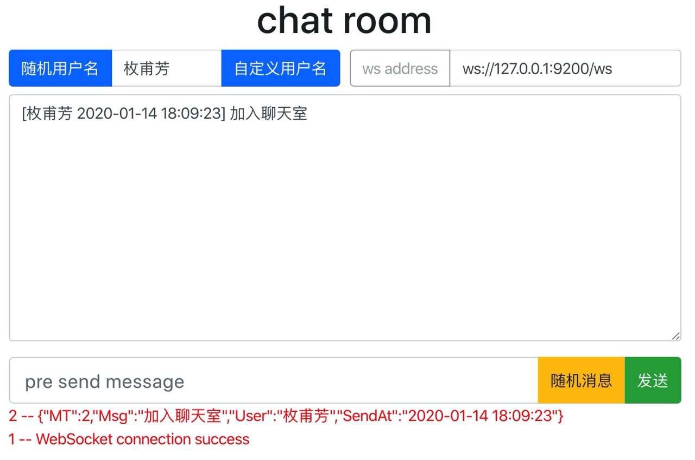

# chatroom
golang简单聊天室, 使用 `h5 + gorilla` 实现, 可自由拓展为多个聊天室

## 在线体现地址
[http://demo.xxjj.cf:9200](http://demo.xxjj.cf:9200)

## 运行
- 安装 golang  
- 使用`vgo`进行版本控制,开启`GO111MODULE`  
unix/linux 下开启: `export GO111MODULE=on`  
windows 下开启: `go env -w GO111MODULE=on`  

- 下载并运行`chatroom`
    ```shell script
    git clone https://github.com/gohouse/chatroom.git --depth=1
    cd chatroom
    go mod tidy && go mod download
    go run main.go
    ```

## 效果图

